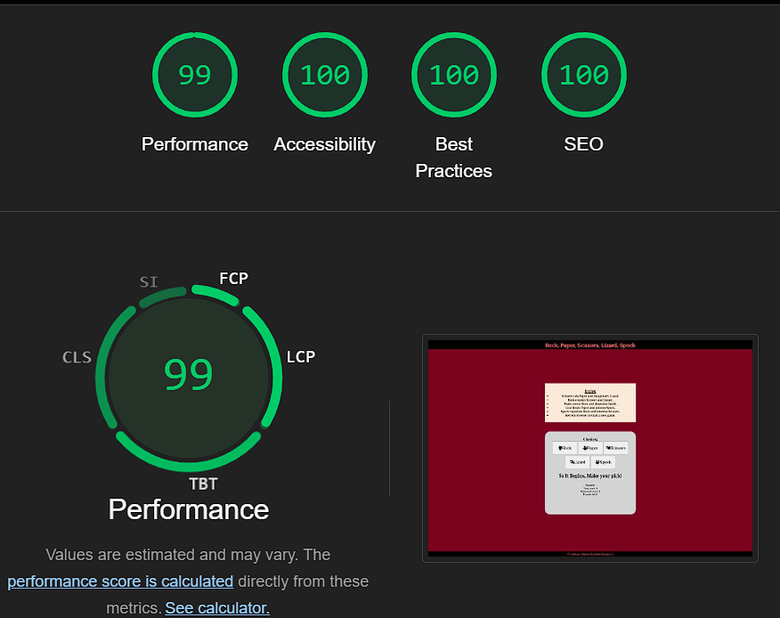
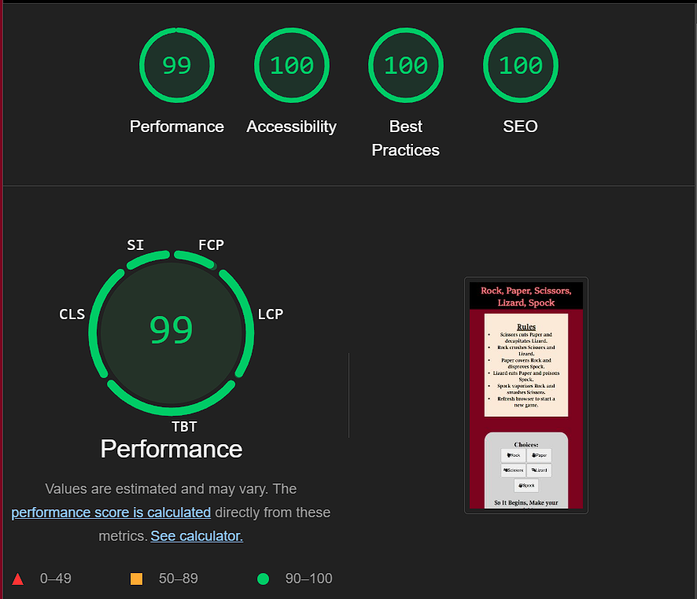

# Rock, Paper, Scrissors, Lizard, Spock

The following is a website created for Project Portfolio 2 of the Code Institute L5 programme, it is made using the the idea from Code Institute and consists of playing a game of rock, paper, scissors, lizard, spock against the computer with the scores being shown at the bottom.

# [Live web page](https://grahammaher.github.io/Rock-paper-scissors-lizzard-and-spock/)

# Table of Contents
1. [Rock,Paper,Scissors,Lizard,Spock](#rock-paper-scrissors-lizard-spock)
2. [Launch the website](#live-web-page)
3. [Overview](#overview)
4. [Planning](#planning)
5. [Design](#design)
    - [Header and Footer](#header--footer)
    - [Colours](#colours)
    - [Imagery](#imagery)
    - [Message Font](#message-font)
    - [Back-up Fonts](#back-up-fonts)
6. [Features](#features)
    - [Choice Buttons](#choice-buttons)
    - [Difficulty Level](#difficulty-level)
    - [Gameover message](#game-over-message)
7. [Technologies and tools used](#technologies-and-tools-used)
8. [Testing](#testing)
    - [HTML Validation](#html-validation)
    - [CSS Validation](#css-validation)
    - [JS Validation](#js-validation)
    - [Google dev tool Lighthouse](#google-dev-tool-lighthouse)
        - [Desktop](#desktop)
        - [Mobile](#mobile)
9. [Deployment](#deployment)
10. [Bugs](#bugs)
11. [Credits and Acknowlegements](#credits-and-acknowlegements)

# Overview
Rock, Paper, Scissors, Lizard, Spock is a game created for project potfolio 2.
The website was created to show the use and understanding of JavaScript.
It is a game of Rock, Paper, Scissors, Lizard, Spock vs the computer and will created a random choice to respond to the choice that you, the user has chosen. Based on the parameters stated in the JavaScript function it was either show a victory or a loss, based on this outcome the score will be captured and displayed at the bottom of the page under the scores heading.
  ## Goals
   ### External User
   - The site’s users want to play an online game that has elements of chance. 
   ### Site owner
   - The site’s goal is to provide a challenging game with increasing levels of difficulty to entertain online users. 
   
# Planning
  ## Wireframes
  

    
Desktop Wireframe

      
  

  

    
Mobile Wireframe

      
  

  # Design
   - ## Header & Footer
     Header font was chosen to give a bold formal statement. Platypi font format was imported from Google Fonts.
   - ## Colours
     Colours were Chosen to simulate a battleground, black to show dark times and red for a battle commencing.
   - ## Imagery
     No images were used but font awesome icons were used to depict the hand shapes that would be used in a real life game.
   - ## Message Font
     The message font was chosen to be a bit more light hearted, as the messages that are given are meant to be humorous. Gupter font format was imported from Google Fonts.
   - ## Back-up Fonts
     Seriff and Sans-Seriff were used as the back-up fonts for the header/footer and message respectively.

# Features
 - ## Choice Buttons
   eventListener is used on the buttons based off of the click on the button selected, calling the functions into action, logging your choice and the opponents random choice.
 - ## Difficulty Level
   Functions remember previous result and choice and will choose next round choice based off of that.
 - ## Game Over message
   End of game message will display either victory or defeat based on scores at the end of the allocated turns.

# Technologies and tools used
  - Html Structure of the webpage
  - CSS Styling of the wepage
  - JavaScript Creation of functions to run in the background to operate the game
  - [Github](https://github.com/GrahamMaher/Rock-paper-scissors-lizzard-and-spock) Creation of project repository
  - [Gitpod](https://grahammaher-rockpapersc-zb35kc42b03.ws-eu115.gitpod.io/) Creation of the workspace for coding
  - [Favicon](https://favicon.io/) Selector for favicon used
  - [Google Fonts](https://fonts.google.com) Selector for fonts used
  - [Font Awesome](https://fontawesome.com/) Icons used
  - [Am I Responsive](https://ui.dev/amiresponsive) Test responsiveness for different media
  - [JSHint](https://jshint.com/) Test JavaScript for errors and warnings
  - [W3C](https://www.w3.org/) Validation of HTML and CSS
  - Balsamiq Wireframes Creation of wireframes for project
  - [CleanPNG](https://www.cleanpng.com/free/kiss.html) Image for the favicon

# Testing
 ## HTML Validation
  - No errors returned
  

 ## CSS Validation
  - No errors returned
  

 ## JS Validation
  - No errors returned
  

 ## Google dev tool Lighthouse
  ### Desktop
   

  ### Mobile
     

# Deployment
 ## Deploy through Github Repositiory
 ### Steps
 -[Repository](https://github.com/GrahamMaher/Rock-paper-scissors-lizzard-and-spock)
 1. Click on repository you would like to deploy.
 2. Go to settings tab top left of the page in the nav menu.
 3. Select pages
 4. Under Build and Deployment select source- deploy from branch
 5. Under branch select-main
 6. Under folder select root and click save.
 7. Top of the page will now state that your page is now live and will give you the icon to launch your website.

# Bugs
  - Title error given under HTML validation, removed duplicate title element.
  - Syntax errors corrected
  - Missing semi-colons
  - gameOver message not displaying, add quotations marks
  - Opponents score not increasing, add () after function
  - All known bugs have been corrected

# Credits and Acknowlegements
  - Kera Cudamore https://github.com/kera-cudmore/readme-examples?tab=readme-ov-file#how-to-write-your-readme -Readme tips and tricks
  - Slack community
  - Build Rock Paper Scissors Game with Vanilla JavaScript for Beginners (HTML, CSS, JS)s Clever Programmer https://www.youtube.com/watch?v=tzjF8LkfWfc - basic ideas
  - https://stackoverflow.com/questions/64712803/change-game-difficulty-javascript - information on increasing difficulty levels
  - https://forum.freecodecamp.org/t/rock-paper-and-scissors/656175 - code information
  - Code Institute Love Maths walkthrough project - Basic ideas and guidance
  - My previous project Trout Fishing Haven - Information on Readme files