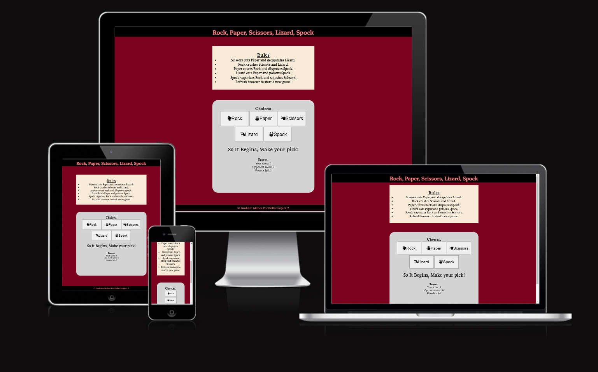
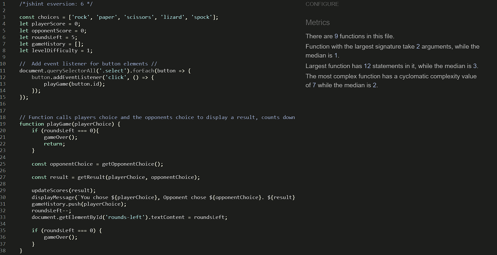

# Rock, Paper, Scrissors, Lizard, Spock

The following is a website created for Project Portfolio 2 of the Code Institute L5 programme, it is made using the the idea from Code Institute and consists of playing a game of rock, paper, scissors, lizard, spock against the computer with the scores being shown at the bottom.

# [Live web page](https://grahammaher.github.io/Rock-paper-scissors-lizzard-and-spock/)

# Table of Contents

# Overview
Rock, Paper, Scissors, Lizard, Spock is a game created for project potfolio 2.
The website was created to show the use and understanding of JavaScript.
It is a game of Rock, Paper, Scissors, Lizard, Spock vs the computer and will created a random choice to respond to the choice that you, the user has chosen. Based on the parameters stated in the JavaScript function it was either show a victory or a loss, based on this outcome the score will be captured and displayed at the bottom of the page under the scores heading.

# Planning
  ## Wireframes
  

    
Desktop Wireframe

      
  

  

    
Mobile Wireframe

      
  

  # Design
   - ## Header & Footer
     Header font was chosen to give a bold formal statement. Platypi font format was imported from Google Fonts.
   - ## Colours
     Colours were Chosen to simulate a battleground, black to show dark times and red for a battle commencing.
   - ## Imagery
     No images were used but font awesome icons were used to depict the hand shapes that would be used in a real life game.
   - ## Message Font
     The message font was chosen to be a bit more light hearted, as the messages that are given are meant to be humorous. Gupter font format was imported from Google Fonts.
   - ## Back-up Fonts
     Seriff and Sans-Seriff were used as the back-up fonts for the header/footer and message respectively.

# Features
 - ## Choice Buttons
   eventListener is used on the buttons based off of the click on the button selected, calling the functions into action, logging your choice and the opponents random choice.
 - ## Difficulty Level
   Functions remember previous result and choice and will choose next round choice based off of that.
 - ## Game Over message
   End of game message will display either victory or defeat based on scores at the end of the allocated turns.

# Technologies and tools used
  - Html Structure of the webpage
  - CSS Styling of the wepage
  - JavaScript Creation of functions to run in the background to operate the game
  - [Github](https://github.com/GrahamMaher/Rock-paper-scissors-lizzard-and-spock) Creation of project repository
  - [Gitpod](https://grahammaher-rockpapersc-zb35kc42b03.ws-eu115.gitpod.io/) Creation of the workspace for coding
  - [Favicon](https://favicon.io/) Selector for favicon used
  - [Google Fonts](https://fonts.google.com) Selector for fonts used
  - [Font Awesome](https://fontawesome.com/) Icons used
  - [Am I Responsive](https://ui.dev/amiresponsive) Test responsiveness for different media
  - [JSHint](https://jshint.com/) Test JavaScript for errors and warnings
  - [W3C](https://www.w3.org/) Validation of HTML and CSS
  - Balsamiq Wireframes Creation of wireframes for project
  - [CleanPNG](https://www.cleanpng.com/free/kiss.html) Image for the favicon

# Testing
 ## HTML Validation
  - No errors returned
  

 ## CSS Validation
  - No errors returned
  

 ## JS Validation
  - No errors returned
  

 ## Google dev tool Lighthouse
  ### Desktop
   

  ### Mobile
     